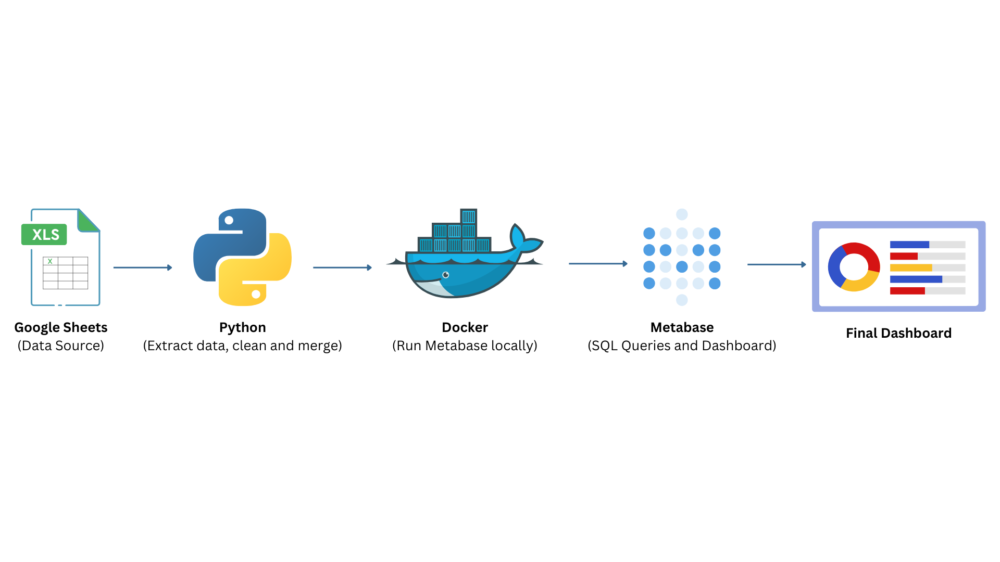
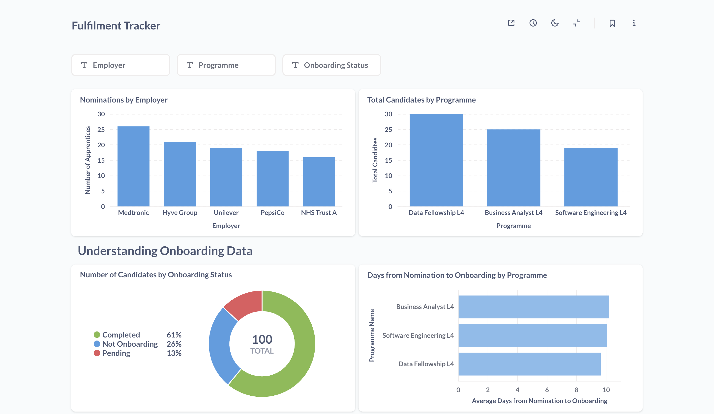
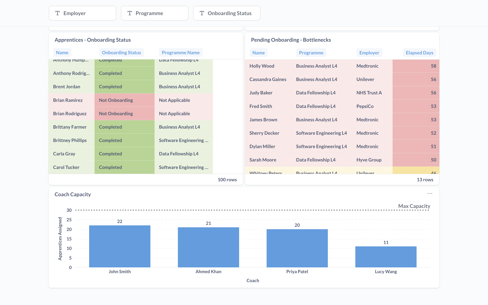

# Apprentice Fulfilment Tracker Dashboard

This project is an end-to-end automated data pipeline and dashboard that tracks apprentice fulfilment progress using real-time (sample) data from Google Sheets.

It includes:
- 📄 Dynamic data extraction from Google Sheets using Python and `gspread`
- 🧹 Data cleaning and transformation (e.g. tracking days to diagnostic, assignment, and onboarding)
- 💾 Local storage into a SQLite database (`fulfilment_tracker.db`)
- 📊 A fully interactive Metabase dashboard running on Docker
- 🖥 One-click Python script (`run_dashboard.py`) to process data, launch Metabase, and open the dashboard on `localhost:3000`

This is ideal for demoing how data automation and self-serve analytics can be deployed quickly and effectively.

---

📁 Dashboard Includes:
- Apprentice progress tracking (nomination → onboarding)
- Time-to-onboard metrics
- Bottlenecks (e.g. 50+ days since assignment)
- Coach capacity breakdown
- Filters by employer, programme, and onboarding status

🧰 Tech Stack
- Python (pandas, gspread, google-auth)
- Google Sheets (data source)
- SQLite
- Metabase
- Docker

## Tech Stack Flowchart

---

## 📸 Dashboard Screenshots

